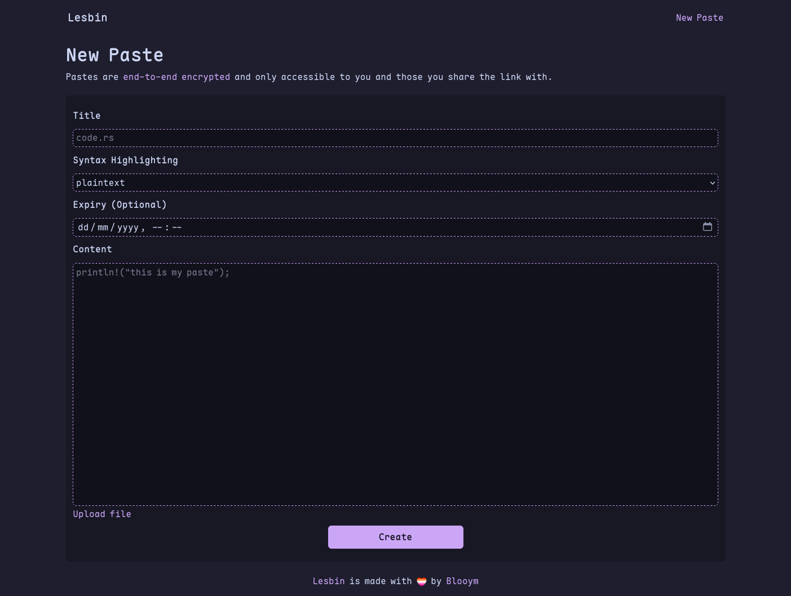
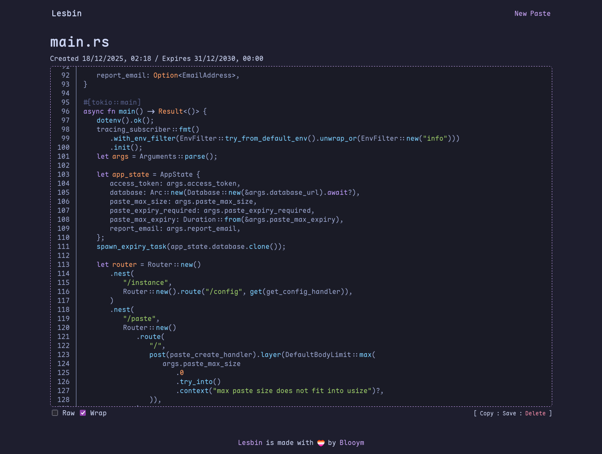

# lesbin

A privacy-first, end-to-end encrypted paste service for sharing your dreams, fanfiction, logs and code.

<table>
    <tr>
        <td></td>
        <td></td>
    </tr>
</table>

## About 

### Features

- **Fully end-to-end encrypted**, pastes can only be viewed by the recipients you send the link to. No one else, not even the server, can view their content.
- **Private**, minimal data is collected about you or your pastes. No accounts and no identifiable info required.
- **Simple interface**, supports syntax highlighting, content raw view and line wrapping.
- **Paste expiry**, set an expiration on your paste and it will automatically be deleted when the time comes.

### What data is stored & encrypted

Everything that doesn't need to be known by the server is encrypted in your browser before leaving your device. Below is a list of data that is collected by the service and how it is stored.

**The following data is encrypted**, only those with the decryption key can access it:

- Paste title.
- Paste content.
- Paste syntax type.

**The following data is unencrypted** for operational purposes:

- Paste identifier.
- Paste creation time.
- Paste expiry time (if set).

**The following data is hashed** by the server before being stored:

- Paste deletion keys.

## Hosting an instance

Hosting Lesbin is simple if you're already familiar with OCI containers. Currently no pre-compiled images or binaries are available, so all building will need to be done manually. To do so:

- Clone this repository locally.
- Read and make any modifications to [compose file](compose.yml) where needed for your setup
- Set environment variables using [the frontend's .env.example file](./frontend/.env.example) and [the api's .env.example file](./api/.env.example) as references.
- Start the compose stack. Please note that you'll need to setup your own reverse proxy.

For simple setups it's enough to only expose the frontend through a reverse proxy and use docker's internal network to access the backend from the frontends container.
